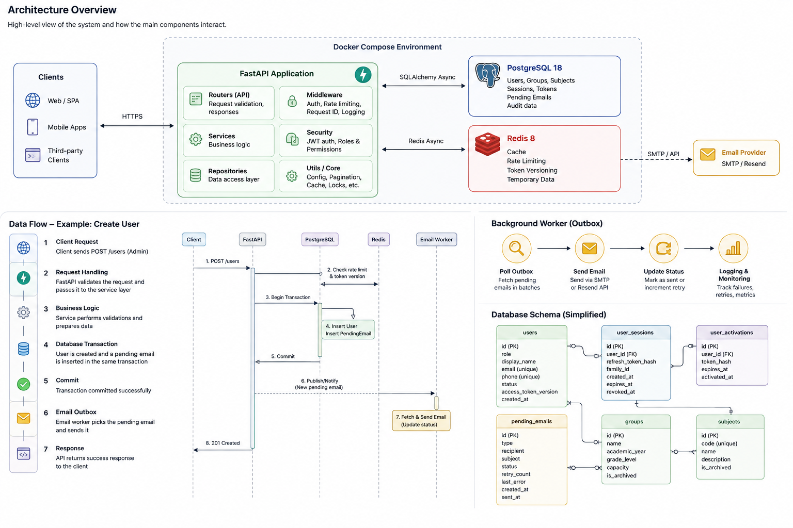

# School Management System — Lite

A production-oriented REST API for managing school staff, students, groups, and subjects.

This project is a focused backend implementation built with **FastAPI**, **PostgreSQL**, **Redis**, and **Docker**, with an emphasis on real-world backend engineering practices such as secure authentication, concurrency control, transactional email delivery, caching, rate limiting, structured logging, and maintainable application architecture.

> **Lite Edition:** This version intentionally focuses on the user-management and school-structure domains. Academics, grades, guardians, and frontend functionality are outside the scope of this release.

---

## Highlights

The project focuses on backend engineering patterns that go beyond basic CRUD operations:

- **Secure authentication** with JWT access tokens and rotating refresh tokens.
- **Refresh-token family tracking** for detecting token reuse and potential token theft.
- **Per-user access-token versioning** for immediate server-side token invalidation.
- **PostgreSQL advisory locks** for preventing race conditions during concurrent student registrations.
- **Transactional email outbox** to prevent email loss when an application failure occurs.
- **Background email processing** with retry tracking and failure handling.
- **Structured JSON logging** with request correlation IDs.
- **Liveness and readiness health checks** for application and infrastructure monitoring.
- **Redis caching and rate limiting** for frequently accessed resources and request protection.
- **Docker Compose** for running the application, PostgreSQL, and Redis together.
- **Automated migrations** with Alembic.
- **Unit and integration testing** with pytest.

---

## Architecture

The application follows a layered backend architecture. FastAPI handles HTTP requests, services contain business logic, repositories manage data access, and a background worker handles asynchronous email delivery.



### Main Components

| Component | Responsibility |
|---|---|
| **FastAPI** | HTTP API, routing, middleware, dependencies, authentication |
| **Services** | Business and application logic |
| **Repositories** | Database access and query composition |
| **PostgreSQL** | Primary relational database and transactional state |
| **Redis** | Caching, rate limiting, token versioning, and temporary data |
| **Email Worker** | Background processing of pending emails |
| **SMTP / Resend** | External email delivery |

### Example Request Flow

```text
Client
  │
  │ HTTP request
  ▼
FastAPI
  │
  ├── Middleware / Dependencies
  │
  ▼
Service
  │
  ▼
Repository
  │
  ▼
PostgreSQL
  │
  └── Optional cache interaction with Redis
  │
  ▼
HTTP response
```

### Email Outbox Flow

```text
Business Operation
       │
       ├── Write business data
       └── Write pending email
                │
                ▼
          Commit transaction
                │
                ▼
          Email Worker
                │
                ▼
          SMTP / Resend
                │
                ▼
       Update delivery status
```

This ensures that an application failure after the business transaction commits does not silently lose the email.

---

## Features

### Authentication & Security

- JWT access tokens with per-user versioning for immediate server-side invalidation.
- Rotating refresh tokens stored as bcrypt hashes with family tracking.
- Refresh-token reuse detection. Reuse of a revoked token invalidates the entire token family.
- Secure refresh-token cookies using `HttpOnly`, `Secure`, and `SameSite=Strict`.
- Account lockout after repeated failed login attempts.
- Forgot-password and admin-initiated password-reset flows.
- Email-change confirmation using short-lived verification codes.
- Invite and reset tokens are stored as hashes rather than raw values.

### User Management

- Four user roles:
  - System Admin
  - Director
  - Teacher
  - Student
- System Admin-controlled registration with no public self-registration.
- Complete account lifecycle:

  `invite → activation → active → deactivated / graduated / expelled / withdrawn`

- Contact uniqueness rules across different user roles.
- Up to three students may share the same phone number or email address to support family use cases.
- PostgreSQL advisory locks protect concurrent student registrations that share contact information.

### School Structure

- Groups with:
  - Academic year
  - Grade level
  - Capacity
- Student-to-group assignment.
- Subject management with unique subject codes.
- Archive and restore functionality for groups and subjects.
- Role-based access for System Admins and Directors.

### Email Infrastructure

- Transactional **outbox pattern** for reliable email delivery.
- Emails are written to the `pending_emails` table in the same transaction as the operation that triggered them.
- Background worker polls the outbox and sends pending emails.
- Retry tracking and last-error information for failed deliveries.
- System Admin interface for viewing email history and manually retrying failed deliveries.
- Configurable email providers using SMTP or Resend.

### Observability

- Structured JSON logging using `structlog`.
- Consistent `snake_case` event names and structured log fields.
- Request correlation IDs injected through middleware.
- Liveness endpoint: `/health/live`
- Readiness endpoint: `/health/ready`
- Readiness checks PostgreSQL and Redis with timeouts and returns `503` when dependencies are unavailable.
- Application configuration is validated at startup using Pydantic Settings.

### Infrastructure

- Docker Compose environment with:
  - Application
  - PostgreSQL 18
  - Redis 8
- Health-checked service dependencies.
- Alembic migration history from the initial schema through subsequent migrations.
- IP-based rate limiting using SlowAPI.
- Redis caching for frequently accessed user and entity details.
- Explicit cache invalidation after mutations.

---

## Tech Stack

| Layer | Technology |
|---|---|
| Framework | FastAPI |
| ORM | SQLAlchemy 2.0 Async |
| Database | PostgreSQL 18 |
| Cache / Rate Limiting | Redis 8 |
| Migrations | Alembic |
| Authentication | python-jose (JWT), bcrypt |
| Validation | Pydantic v2, phonenumbers |
| Email | aiosmtplib, Resend |
| Logging | structlog |
| Testing | pytest, pytest-asyncio, httpx, pytest-mock |
| Linting / Typing | Ruff, mypy |
| Containers | Docker, Docker Compose |

---

## Project Structure

```text
src/
├── api/
│   └── health.py
├── auth/
├── core/
├── emails/
├── groups/
├── subjects/
├── users/
│   ├── models/
│   ├── repositories/
│   ├── routers/
│   ├── services/
│   └── utils/
├── workers/
│   └── email_worker.py
└── utils/
```

### Main Responsibilities

| Directory | Responsibility |
|---|---|
| `api/` | Application-level endpoints such as liveness and readiness checks |
| `auth/` | Login, logout, refresh, activation, and password-related flows |
| `core/` | Configuration, database, Redis, security, middleware, pagination, locking, rate limiting, and caching |
| `emails/` | Pending email model, outbox functionality, and administrative email endpoints |
| `groups/` | Group CRUD, archive/restore, and access control |
| `subjects/` | Subject CRUD, archive/restore, and access control |
| `users/models/` | User, session, activation, and login-lockout models |
| `users/repositories/` | Database queries, sorting, and pagination |
| `users/routers/` | System Admin, Director, and shared user endpoints |
| `users/services/` | Application and business logic for user operations |
| `users/utils/` | Contact-limit checks, constants, and user-specific exceptions |
| `workers/` | Background email processing |
| `utils/` | Shared enums, validators, exceptions, helpers, and cache keys |

---

## API Overview

| Module | Main Operations | Access |
|---|---|---|
| **Auth** | Login, logout, refresh token, activate account, forgot password, reset password | Public / Authenticated |
| **Users — Admin** | Register, update profile, update credentials, activate, deactivate, password reset, resend invite, list/get teachers and students | System Admin |
| **Users — Director** | List/get teachers and students | Director |
| **Users — Shared** | Get/update profile, update credentials/password, confirm email change, get student profile | Authenticated Users |
| **Subjects** | Create, update, archive, restore, list, get by ID | System Admin / Director |
| **Groups** | Create, update, archive, restore, list, get by ID | System Admin / Director |
| **Emails** | List emails, get by ID, retry failed emails | System Admin |
| **Health** | Liveness and readiness checks | Public |

### API Documentation

When running locally, interactive API documentation is available at:

```text
http://localhost:8000/docs
```

> The interactive documentation is intended for development use.

---

## Engineering Decisions

### Advisory Locking for Student Contact Limits

Students may share phone numbers and email addresses, with a limit of three students per contact value to support common family use cases.

A simple count-then-insert operation is vulnerable to race conditions when multiple registrations occur concurrently. Partial unique indexes alone cannot enforce this limit.

To address this, PostgreSQL's `pg_advisory_xact_lock` is acquired at the beginning of the transaction before checking the existing contact count.

Phone and email locks are acquired in a consistent order to avoid deadlocks.

---

### Refresh Token Family Tracking

Each refresh-token rotation creates a new token while preserving a shared `refresh_token_family` identifier.

If a previously rotated token is presented again, the application treats it as possible token reuse. The entire token family is then invalidated, requiring the affected user to authenticate again.

This provides a mechanism for detecting and containing refresh-token theft.

---

### Access Token Versioning

Each user has an `access_token_version` stored in PostgreSQL and cached in Redis.

The current version is included in issued JWTs and validated during protected requests.

When a security-sensitive event occurs, such as:

- account deactivation
- credential changes
- logout

the user's token version is incremented.

Existing access tokens then become invalid immediately instead of remaining usable until their normal expiration time.

---

### Transactional Outbox for Email Delivery

Emails are stored in a `pending_emails` table within the same database transaction as the operation that triggered the email.

A background worker later polls the outbox and sends the messages through the configured provider.

This prevents a failure between the business operation and email delivery from silently losing the email.

```text
Create User
    │
    ├── Create database record
    ├── Create pending email record
    │
    └── Commit transaction
             │
             ▼
       Email Worker
             │
             ▼
       SMTP / Resend
```

If the application crashes after the transaction commits, the email remains in the outbox and can be processed when the worker resumes.

---

### Structured Logging

Application logs use structured JSON events instead of free-form messages.

Examples include:

```text
user_registered
login_failed
```

A request-ID middleware generates a correlation ID for each request and makes it available to log events throughout the request lifecycle.

This makes it easier to trace a specific request through application logs and diagnose failures.

---

## Getting Started

### Prerequisites

- Git
- Docker
- Docker Compose

### Clone the Repository

```bash
git clone https://github.com/themslmjnn/School-Management-System-Lite.git
cd School-Management-System-Lite
```

### Configure Environment Variables

```bash
cp .env.example .env
```

Configure the required values in `.env`.

### Start the Application

```bash
make up
```

This starts the application together with PostgreSQL and Redis.

### Run Database Migrations

```bash
make migrate
```

### View Application Logs

```bash
make logs
```

The API will be available at:

```text
http://localhost:8000
```

Interactive API documentation:

```text
http://localhost:8000/docs
```

---

## Makefile Commands

| Command | Description |
|---|---|
| `make up` | Build and start the complete application stack |
| `make down` | Stop and remove containers |
| `make migrate` | Run `alembic upgrade head` inside the running application container |
| `make logs` | Follow application logs |
| `make format` | Format the code using Ruff |
| `make lint` | Run Ruff linting |
| `make typecheck` | Run mypy type checking |

---

## Testing

The test suite uses a dedicated test environment with PostgreSQL and Redis.

Tests refuse to run unless:

```text
ENVIRONMENT=test
```

This protects against accidentally running destructive test operations against a development or production database.

Run the test suite with:

```bash
pytest
```

### Test Coverage

The test suite contains **92 test files** covering:

- Authentication
- Users
- Subjects
- Groups
- Emails

Tests are divided into:

- **Unit tests** for service and business logic with mocked dependencies.
- **Integration tests** covering full HTTP requests through the application with a real test database and transaction rollback between tests.

---

## Scope & Limitations

This is intentionally a **Lite** release. The following functionality is outside the scope of this project:

- **Academics** — teaching assignments, student subject enrollments, and head-of-class functionality.
- **Grades** — grade records and grade history.
- **Guardians** — parent accounts and guardian-student relationships.
- **Frontend** — this repository contains the backend API only.

These areas are implemented in **Meridian AMS**, the full-scale successor and ground-up redesign of this project, which expands the user architecture, academics functionality, CI/CD, and deployment capabilities.

---

## Project Goals

The primary goal of this project is to demonstrate practical backend engineering rather than simply implementing a collection of CRUD endpoints.

The project focuses on:

- Designing maintainable application architecture.
- Building secure authentication and authorization flows.
- Handling concurrency correctly.
- Making transactional workflows reliable.
- Introducing asynchronous background processing.
- Applying caching and rate limiting appropriately.
- Building observable services with structured logging.
- Writing unit and integration tests.
- Running the application in a containerized environment.

---
